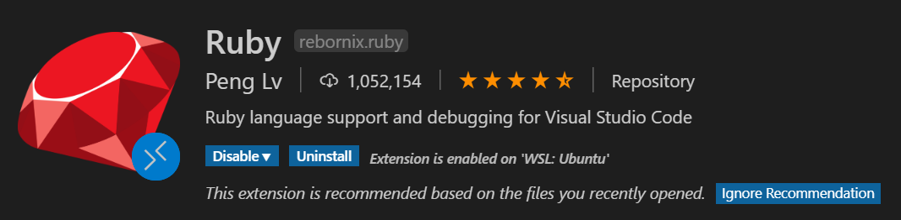

This is a tutorial on how to set up a *Ruby* development environment on *VS Code*

This tutorial includes: 

- Basic *Ruby* language support, including:
    - Syntax highlighting
    - Basic auto completion and suggestions
    - *Git* managements
- Advanced *Ruby* language support, including:
    - Lint (VS Code call this, *IntelliSense*) and suggestions given based on type system
    - Class hierarchy view
    - Inline documentation
- **Debugging** using a graphic user interface 

## Recipe

- Visual Studio Code

## Requirements

- Internet connection
- Have all necessary modules installed (i.e., have completed project 0)

Personally, I am using *WSL* on *Windows* with the distribution of *Ubuntu*. 

For Linux, (*Ubuntu* distribution), the steps should be reasonably the same (but of course Linux users don't need to setup *WSL* connection)

Things might be different on *Mac OS*. 

## Disclaimer

I am new to *Ruby*. To be honest, I don't have a complete knowledge of what the following steps are doing. These are solutions collected and organized from websites like *Stackoverflow* or something else. 

I cannot make sure that these solutions would work on your computer. If so, well, good luck then. 

If you manage to set up the configurations, I am not supposed to take any responsibility of the consequences. 

> I mean, they should work fine, but just in case. 

# Basic Installations

## 1. Set up connection to *WSL*

> Although I believe most of you should have done this step, but just in case. 

Go to *Extensions*, and search **Remote - WSL**

And download it. 

It should also download some other dependent extensions, including:

<!--TODO-->

## 2. Connect to *WSL*

<!--TODO-->

## 3. Install *Ruby* extension

Go to *Extensions*, and search **Ruby**



>  Actually this extension should be marked with a little star, meaning that it is a recommended extension

It should also download some other dependent extensions, including:

<!--TODO-->

## Now try it

Open the project folder, and start editing. 

We can find some simple suggestions as shown: 

<!--TODO-->

The basic *Ruby* setup tutorial has finished. 

---

## Advanced *Ruby* Language Support

### Set up *IntelliSense*

In order to utilize the powerful functionality of *IntelliSense*, we need to install another extension, called ***Solargraph***, which can also be found on VS Code extension market. 

<!--TODO-->

After installing this extension, we can find that it is not working as intended. 

This is totally right, because in its description, it says we also need to install its language server to make it work. 

> The mechanism of VS Code *IntelliSense* and the function of VS Code language server is not to be discussed here, but we ca just think the following gem is an essential module. 

Type the following command to install the gem: 

```shell
sudo gem install solargraph
```

> In the description page of *Solargraph*, `sudo` command is not necessary, but just in case. 

#### For WSL users

you might get an error

<!--TODO-->

#### For Mac users

You can just ignore this part. 

#### For Linux(*Ubuntu*) users

If you encounter any problem, go to the [Windows](# For WSL users) section to find out possible solutions. 

