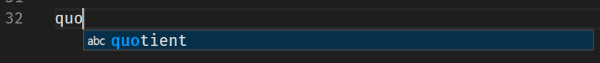
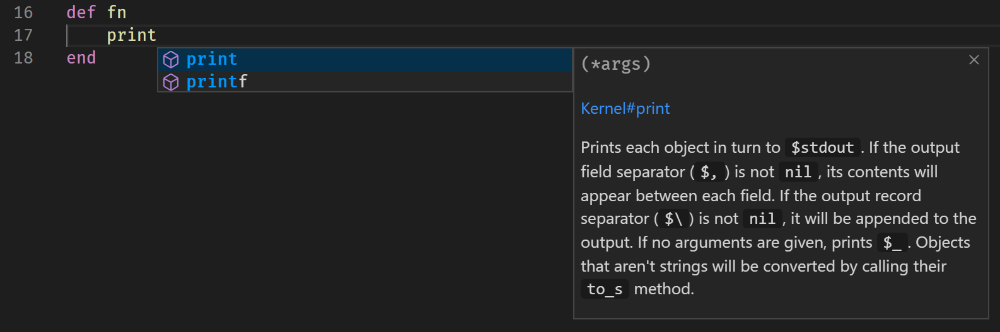
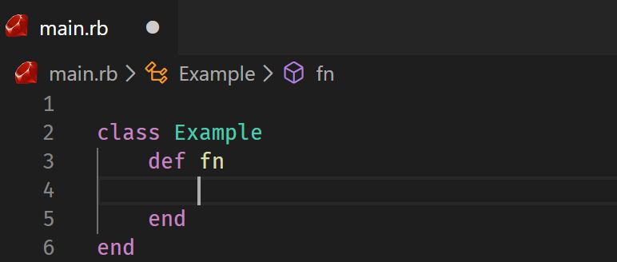
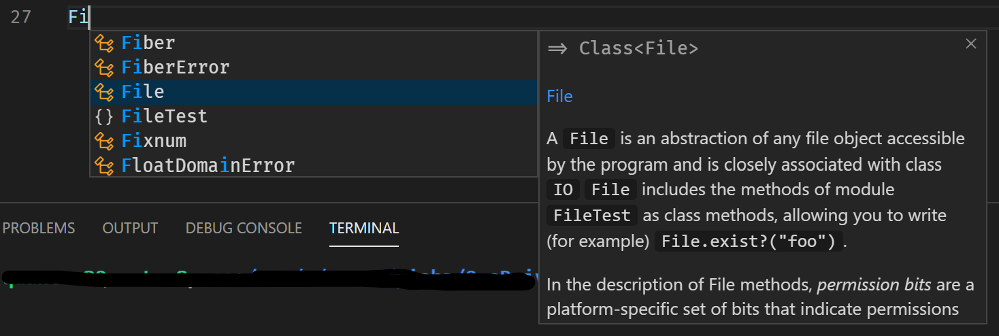

# Overview: Ruby with VS Code

This is a tutorial on how to set up a *Ruby* development environment on *VS Code*

This tutorial includes: 

- Basic *Ruby* language support, including:
    - Syntax highlighting
    - Basic auto completion and suggestions
    - *Git* managements
- Advanced *Ruby* language support, including:
    - Lint (VS Code call this, *IntelliSense*) and suggestions given based on type system
    - Class hierarchy view
    - Inline documentation
- **Debugging** using a graphic user interface 

## Recipe

- Visual Studio Code

## Requirements

- Internet connection
- Have all necessary modules installed (i.e., have completed project 0)

Personally, I am using *WSL* on *Windows* with the distribution of *Ubuntu*. 

For Linux, (*Ubuntu* distribution), the steps should be reasonably the same (but of course Linux users don't need to setup *WSL* connection)

Things might be different on *Mac OS*. 

## Disclaimer

I am new to *Ruby*. To be honest, I don't have a complete knowledge of what the following steps are doing. These are solutions collected and organized from websites like *Stackoverflow* or something else. 

I cannot make sure that these solutions would work on your computer. If so, well, good luck then. 

If you manage to set up the configurations, I am not supposed to take any responsibility of the consequences. 

> I mean, they should work fine, but just in case. 

# Basic Installations

## 1. Set up connection to *WSL*

> Although I believe most of you should have done this step, but just in case. 

Go to *Extensions*, search **Remote - WSL**, it looks as shown:

<!--TODO-->

And download it. 

There should be a little "~>~^<^" like icon at the lower left corner like this:

<!--TODO-->

## 2. Connect to *WSL*

1. Click this icon, and select **Remote WSL: New window** (or any other options if you like)

2. After doing this, *VS Code* will start to set up a connection. 

3. When we see this

    <!--TODO-->

    We are done. 

## 3. Install *Ruby* extension

Before move on to anything further, let's set up a test project to see if the following can work. 

> The following steps are so trivial that most of us should just ignore it. But it is here, just in case. 

1. Click the *Terminal* button on the menu bar and choose *New Terminal*
2. Create a folder
3. Open this folder

### The Actual Stuff

Go to *Extensions*, and search **Ruby**


>  Actually this extension should be marked with a little star, meaning that it is a recommended extension

Make sure you install it on *WSL* (for *WSL* users)

It should also download some other dependent extensions, including:

<!--TODO-->

## 4. Now try it

Open the project folder, and start editing. 

We can find some simple suggestions as shown: 



The default suggestions can provide fairly good amount of information, but they are only based on string literals. 

**Can we have better experience? **

Well, the basic *Ruby* setup tutorial has just finished. 

---

## Advanced *Ruby* Language Support

### Set up *IntelliSense*

In order to utilize the powerful functionality of *IntelliSense*, we need to install another extension, called ***Solargraph***, which can also be found on VS Code extension market. 

It looks like this:


In addition to this, *Solargraph* also provides some very cool utilities such as:

- Inline documentation

    

- Hierarchy view

    
    
- And some other cool things

After installing this extension, we can find that it is not working as intended. 

> If we see a popup message with a nice little *Install* button, ignore it. 

This is totally right, because in its description, it says we also need to install its language server to make it work. 

> The mechanism of VS Code *IntelliSense* and the function of VS Code language server is not to be discussed here, but we ca just think the following gem is an essential module. 

Type the following command to install the gem: 

```shell
sudo gem install solargraph
```

> In the description page of *Solargraph*, `sudo` command is not necessary, but just in case. 

#### For WSL users

you might get an error

<!--TODO-->

#### For Mac users

You can just ignore this part. 

#### For Linux(*Ubuntu*) users

If you encounter any problem, go to the [Windows](# For WSL users) section to find out possible solutions. 

### We are done

This is the end of advanced *Ruby* language support. 

We can find something like this:



### Some noticeable drawbacks

- After the code document is loaded in to the editor, *Solargraph* will not take effect immediately. In fact, there is a little loading icon on the status bar like this:

    

> **Important Note: **
>
> If the language server cannot be setup, there must be something wrong with your installation steps. Go back and check the [previous steps](### Set up IntelliSense)

> *IntelliSense* is supposed to be working after the language server is successfully set up. 
>
> However, it is very common that *Solargraph* will **take even more time** to completely function. 
>
> And to be honest, I am not quite clear about the reason. 

- *Solargraph* can fail to parse the code file at anytime, for any length of durations. I don;t know the exact reason neither. But, when it fails to work, 

    1. Check if there is any syntax errors in your code file
    2. If not, *please just accept it*. It might go live again after **a few moments**. 

    You will still be able to use the suggestions powered by the *Ruby* extension mentioned above. 

# Debugging

As we can see, there is a *Debug* tab near main editor window. 

Ignore it for now. 

